# Proyecto de Parqueadero - ESPE 
El objetivo principal es la gestión de espacios.
Los espacios están agrupados por zonas.
Espacios de vehículos y motocicletas.
Subzonas en ciertos casos.

## Valor adicional
* Disponibilidad en tiempo real de ciertas zonas. 
* Redirige a un parquedero en la zona escogida.
* Optimización de cobros.
* Gestión de vehículos en cada espacio.
* Identificación de espacios
* Planes de parqueo
* Gestión de usuarios (Persona natural, empresa)
---
Vehículos institucionales no pagan
---

```mermaid
architecture-beta

        group sys(cloud)[Sistema]
        service ms-core(logos:spring)[Core Zonas y Espacios]  in sys
        service ms-vehiculos(logos:nestjs)[Vehiculos y Propietarios]  in sys
        service ms-tickets(server)[ms tickets] in sys
        service ms-auth(server)[ms auth] in sys
        service ms-audit(server)[MS AUDITORIA] in sys
        service api-gate(server)[API Gateway]
        ms-vehiculos:L -- R:api-gate
        ms-tickets:L -- R:api-gate
        ms-auth:L -- R:api-gate
        ms-audit:L -- R:api-gate
          ms-core:L -- R:api-gate
        
        service postman(logos:postman)[Postman]
        service Front(logos:react)[Frontend]
        postman:L -- R:api-gate
        Front:L -- R:api-gate
```

## Actividades semana final
- Presentar microservicio de usuarios y roles
- Validar funcionamiento roles y restricciones.
- Para la próxima clase:
    * Crear API Gateway
        * Kong: Sin código
        * Otra tecnología

- Al crear ticket
 * Buscar usuario por username, apellido, dni
 * Buscar info del vehículo
 * Buscar disponibilidad (Zonas y Espacios)
 * Conectar a un front (Axios, Fetch) [Aun no]

 ### Para el lunes
 * Todas las funcionalidades implementadas y orientadas a tickets
 * Endpoints documentados en OpenAPI
 * API Gateway

 Problema de separar demasiado los servicios, diferentes IPs, necesita gestionar los firewalls y proxys. 
